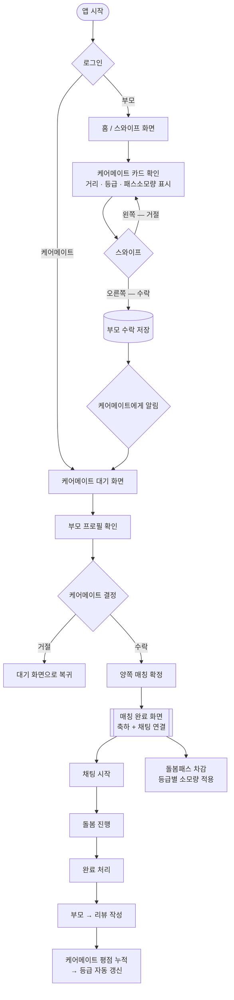
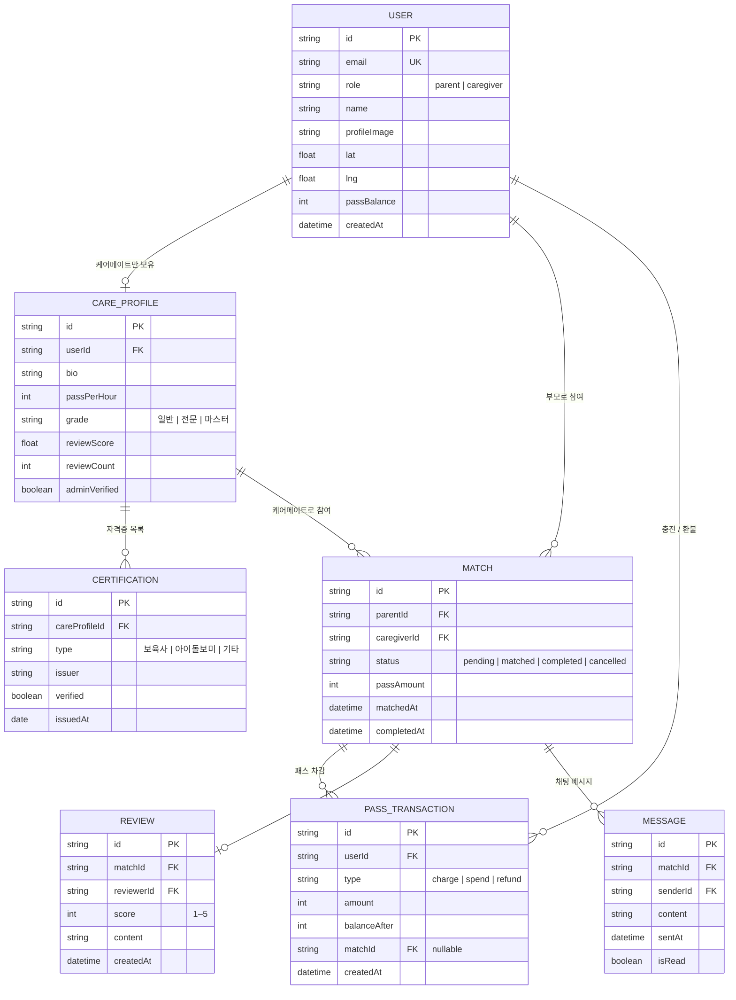
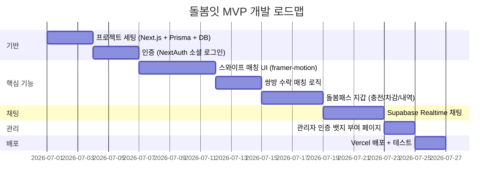

# 돌봄잇 (Dolbom-it!) — 개발 기획서

> GPS 기반 쌍방향 스와이프로 국가 인증 돌보미를 즉시 매칭하는 동네 돌봄 플랫폼.

---

## 1. 핵심 기능 4가지

| # | 기능 | 설명 |
|---|------|------|
| 1 | **스와이프 매칭** | 부모와 케어메이트가 서로의 프로필을 보고 양쪽 모두 수락해야 매칭 확정. 틴더 UX. |
| 2 | **국가 인증 뱃지** | 경찰청(범죄이력) · 복지부(자격증) DB 연동. MVP에서는 관리자 수동 인증 부여. |
| 3 | **돌봄패스(Care-Pass)** | 포인트처럼 쓰는 내부 결제 단위. 케어메이트 등급에 따라 차등 소모. |
| 4 | **리뷰·평점 시스템** | 돌봄 완료 후 부모가 별점(1–5) + 텍스트 리뷰 작성. 누적 리뷰 기반 케어메이트 등급 자동 산정. |

### 돌봄패스 세부 정책

- **충전 방식**: 카카오페이·신용카드로 충전. 1패스 = 1,000원.
- **등급별 시간당 소모량**: 일반 5패스 / 전문 10패스 / 마스터 15패스
- **환불 정책**: 매칭 확정 후 24시간 이내 취소 시 전액 환불. 이후 취소 시 사용분 50% 차감.

---

## 2. 사용자 유형 2가지

| 유형 | 설명 |
|------|------|
| **부모 (Parent)** | 자녀 돌봄이 필요한 보호자. 케어메이트 카드를 스와이프하고 돌봄패스로 결제. |
| **케어메이트 (CareGiver)** | 국가 인증 보육사·아이돌보미. 프로필 등록 후 부모의 수락을 기다렸다가 최종 수락/거절. |

---

## 3. 화면 목록 (MVP 5개)

| 화면 | 내용 |
|------|------|
| 홈 / 스와이프 | 케어메이트 카드 넘기기, 거리·등급·패스 소모량 표시 |
| 케어메이트 프로필 | 자격증·경력·리뷰·국가인증 뱃지 상세 |
| 매칭 완료 | 양쪽 수락 시 축하 화면 + 채팅 연결 |
| 돌봄패스 지갑 | 잔액·등급·사용 내역 |
| 채팅 | 매칭 후 부모–케어메이트 1:1 대화 |

---

## 4. 핵심 플로우차트



---

## 5. 데이터 구조 ERD



---

## 6. 기술 스택

| 영역 | 기술 |
|------|------|
| **Frontend** | Next.js 14 (App Router) + TypeScript + Tailwind CSS + shadcn/ui |
| **스와이프 UX / 애니메이션** | framer-motion (드래그 카드), react-hot-toast (알림) |
| **지도 / GPS** | 카카오맵 API (위치 기반 근거리 케어메이트 필터) |
| **Backend / DB** | PostgreSQL + Prisma ORM + NextAuth.js (소셜 로그인) |
| **결제** | 카카오페이 API (돌봄패스 충전) |
| **실시간 채팅** | Supabase Realtime (WebSocket 기반 1:1 채팅) |

---

## 7. MVP 범위 및 단계별 로드맵

### MVP (1단계) — 핵심 3개 완성



### 2단계 — 고도화

- 국가 DB 실연동 (경찰청 범죄이력 API, 복지부 자격증 API)
- 카카오페이 실결제 연동
- 푸시 알림 (Firebase FCM)
- 케어메이트 등급 자동화 로직

### MVP에서 제외 (단순화)

| 제외 항목 | 대체 방안 |
|-----------|-----------|
| 국가 DB 연동 | 관리자 수동 인증 뱃지 부여 |
| 실결제 | 테스트 패스 충전 (관리자 지급) |
| 푸시 알림 | 앱 내 알림 배지로 대체 |

---

## 8. 폴더 구조 (Next.js App Router 기준)

```
dolbom-it/
├── prisma/
│   └── schema.prisma          # User, CareProfile, Match, Pass, Review, Message
├── src/
│   ├── app/
│   │   ├── (auth)/
│   │   │   └── login/         # 소셜 로그인
│   │   ├── (dashboard)/
│   │   │   ├── swipe/         # 홈 / 스와이프 화면
│   │   │   ├── profile/[id]/  # 케어메이트 프로필
│   │   │   ├── match/[id]/    # 매칭 완료 화면
│   │   │   ├── wallet/        # 돌봄패스 지갑
│   │   │   └── chat/[matchId]/ # 채팅
│   │   └── api/
│   │       ├── match/         # 매칭 로직 API
│   │       ├── pass/          # 패스 충전/차감 API
│   │       └── review/        # 리뷰 API
│   ├── components/
│   │   ├── swipe/             # SwipeCard, SwipeDeck
│   │   ├── match/             # MatchModal, MatchConfetti
│   │   ├── chat/              # ChatBubble, ChatInput
│   │   └── ui/                # shadcn/ui 공통 컴포넌트
│   └── lib/
│       ├── prisma.ts
│       ├── kakao-map.ts
│       └── supabase.ts
```

---

*작성일: 2026-06-09 | 상태: 기획 완료 → 개발 착수 가능*
